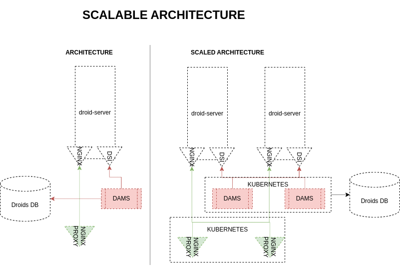

# Appoxy - Cloud Native PaaS

## What is it?

Appoxy is a cloud native PaaS that allows you to deploy your applications to a cluster of servers. It is a work in progress.
Built around the concept of buildpacks, Appoxy can be self-hosted by anyone via a single machine configuration or a highly scalable multi-machine configuration.

## Why Appoxy?

Appoxy is a PaaS that is built with the following principles in mind:
- **Consumable**: Appoxy allows you to let your users deploy their applications on your platform.
- **Cloud Native**: Scalability is a first class citizen. Appoxy is built to be deployed on a single machine or a cluster of machines.
- **Open Source**: Appoxy is built with open source technologies and is open source itself.
- **Simple**: Operating Appoxy and deploying applications on it should be simple and intuitive.

## Tasks to be done
Appoxy is a work in progress. The following features are planned:
- [x] 1-Script server provisioning
- [x] Buildpacks for deploying applications
- [ ] Droid-Server Interface (DSI) - an API for managing apps on a server
- [ ] Droid Administration Microservice (DAMS) - a microservice for managing servers
- [ ] Frontend client for users to manage their applications, and for admins to manage the platform
- [ ] Backend for the frontend client, including a database and a microservice for managing users

## How it works

### Application Management
Users deploy their applications from the frontend client. The frontend client communicates with Droid Administration Microservice (DAMS) which figures out which droid-server to deploy the application on. Once the droid-server is selected, the application is deployed on it via the Droid-Server Interface (DSI). The DSI communicates with the docker daemon of the droid-server to deploy the application.

App Management Operation Flow (Destroying an application)

### Public Internet Access

Appoxy uses a Global Nginx Proxy (or many proxies in scalable configuration) to intercept requests from the public internet and route them to the correct droid-server. Each droid-server has a local Nginx Proxy that routes requests to the correct application.

I.e A request to 'https://myapp.appoxy.com' is intercepted by the Global Nginx Proxy, which queries the database to find the droid-server hosting the application and the unique internal id of the application. The Global Nginx Proxy then routes the request to the local Nginx Proxy of the droid-server. The local Nginx Proxy then routes the request to the correct application by using the unique internal id of the application to match it with the correct container.

Visitor Accessing an Application

### Inside a Droid-Server
A droid-server is a server that can be provisioned by the `provision.sh` script. The script installs docker, docker-compose, pack, DSI, and starts an nginx container. The script also creates a docker network called `droid-net` and attaches it to the nginx container. The nginx container is responsible for routing requests to the droid containers.

The operation workflow of a droid-server can be seen in the following diagram:

The Droid-Server Interface workflow can be seen in the BLUE steps in the diagram. The DSI clones the repository, detects a compatible stack, and creates a builder. It then creates an image using `pack` and runs the image using `docker`. The resulting container (referred to as a droid) is then attached the `droid-net` docker network so that it can communicate with the nginx container. Finally, the image is deleted to save disk space.

The Nginx Proxy workflow can be seen in the GREEN steps in the diagram. The Nginx Proxy is responsible for routing requests to the correct droid container. It does this by using the unique internal id of the application to match it with the correct container. If the requested url is `7d6g824.ds1.appoxy.com` (the user visits `myapp.appoxy.com` which is intercepted by the Global Nginx Proxy, and replaces the name `myapp` with the uid `7d6g824` and the droid-server the app is located on `ds1`), if the app does not exist, a 404 error is returned. Otherwise, if the app is snoozing, the app is woken up. The app is then scheduled to be snoozed after 30 minutes, and the request is routed to the app.

### Final Architecture

