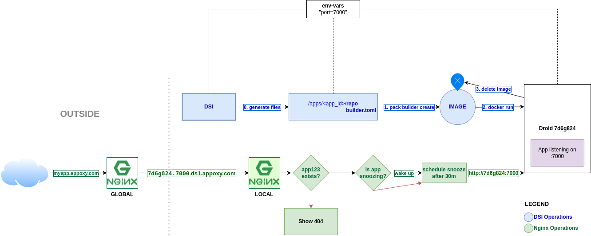

# Droid-Server Interface (DSI)

This interface provides an API for managing droids on a server.

## Functionalities

- Create/Delete/Update droids
- Start/Stop/Restart droids
- Get droid logs
- Get droid status
- Schedule snoozing of droids

## Builders and Buildpacks

Builder Options:
- `heroku-18`
- `heroku-20`
- `heroku-20-build`

## How it works

The DSI operation workflow can be seen in the following diagram:

DSI clones the repository, detects a compatible stack, and creates a builder. It then creates an image using `pack` and runs the image using `docker`. The resulting container (referred to as a droid) is then attached the droid-net docker network so that it can communicate with the nginx container. The nginx container is responsible for routing requests to the droid containers.
