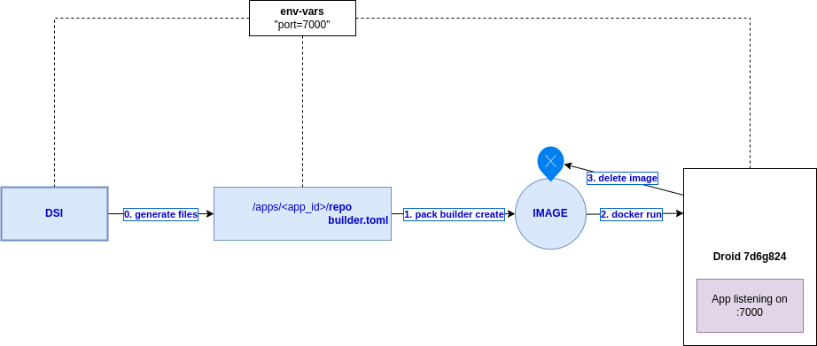
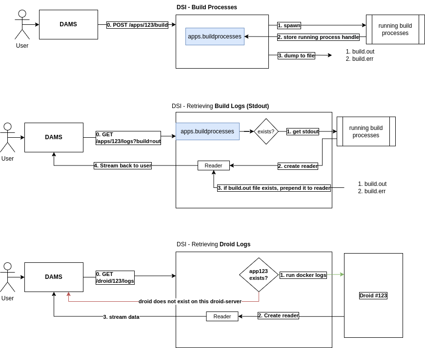

# Droid-Server Interface (DSI)

This interface provides an API for managing droids on a server.

## Functionalities

- Create/Delete/Update droids
- Start/Stop/Restart droids
- Get droid logs
- Get droid status
- Schedule snoozing of droids

## Builders and Buildpacks

Builder Options:

- `heroku-18`
- `heroku-20`
- `heroku-20-build`

## How it works

The DSI main operation workflow can be seen in the following diagram:

DSI clones the repository, detects a compatible stack, and creates a builder. It then creates an image using `pack` and
runs the image using `docker`. The resulting container (referred to as a droid) is then attached the droid-net docker
network so that it can communicate with the nginx container. The nginx container is responsible for routing requests to
the droid containers.

### Logs

There is a special type of log called a buildlog. The retrieval strategy for buildlogs is different from the retrieval strategy for droid logs.

#### Droid Logs

Droid logs are retrieved using the `docker logs` command. The logs are retrieved from the container that is running the droid and are streamed to the client.

Droid logs are not managed by the DSI. They are managed by the docker daemon.
Droid logs can be retrieved using the `GET /droids/:droid_id/logs` endpoint.

#### Buildlogs

Before an application is deployed, a droid must be built for it. The buildlog is the log of the build process. The stdout and stderr of the build process is captured and stored in the build.out
and build.err files respectively. Moreover, if the build process is running, the process handle is stored in memory
until the build process is finished. This allows the user to get the build logs even if the build process is still
running.

Build logs can be retrieved using the `GET /droids/:droid_id/logs?build.out` and `GET /droids/:droid_id/logs?build.err` endpoints.

apps.buildprocesses represents an in-memory map of build processes.
